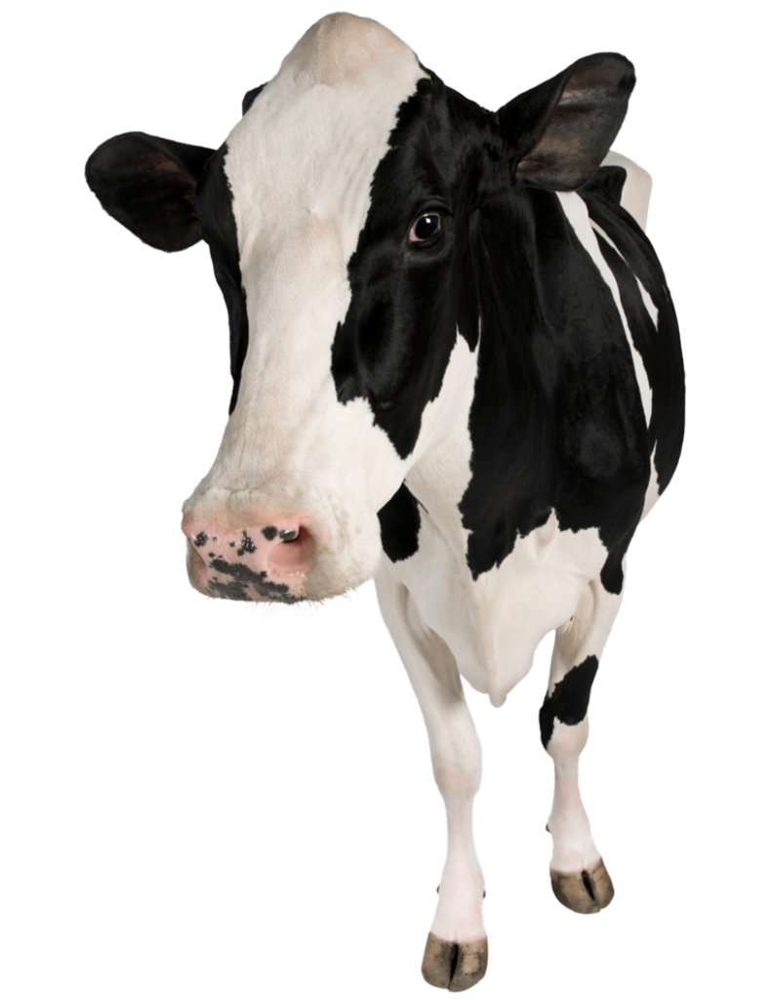

# Little Cow - Vaquinha

Primeiro desenvolvimento de um app em Flutter/Dart.

## Visão geral

O aplicativo é voltado para a repartição da conta de algum estabelecimento, bar ou algo conjunto com seus amigxs. 

Vaquinha ou Little Cow em inglês é um termo urbano no qual o intuito é recolher dinheiro de várias pessoas para uma despesa comum (ex.: fazer uma vaquinha).

O mais legal de tudo é que foi pensando diretamente na comissão do nosso amigx*, camarada, parceirx, patrão ou patroa ou melhor dizer garçom/garçonete. Como assim?
No aplicativo é possível você definir o valor da comissão voltado para x atendente em % (porcentagem) no qual retornará três informações necessárias para fechar a conta, são elas:

- O valor total da conta;  
- O valor individual para cada;  
- E o valor do atendente separadamente.  
     
Aproveite! 

<iframe width="560" height="315" src="https://www.youtube.com/embed/ERFpvIgDDSw" frameborder="0" allow="accelerometer; autoplay; encrypted-media; gyroscope; picture-in-picture" allowfullscreen>
</iframe>

  

 Observação: * A letra 'x' é utilizada em lugares de artigos de gênero como o artigo o/a para maior inclusão. Pensado em todxs.
